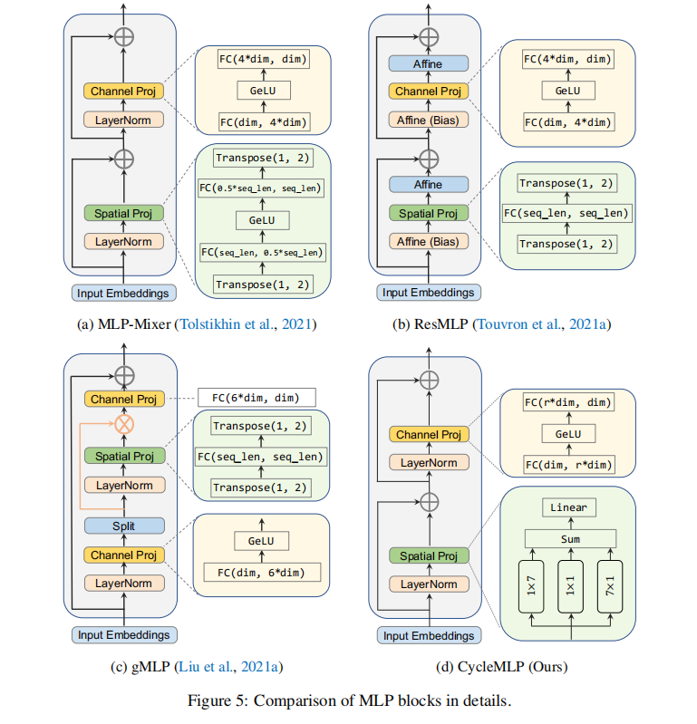
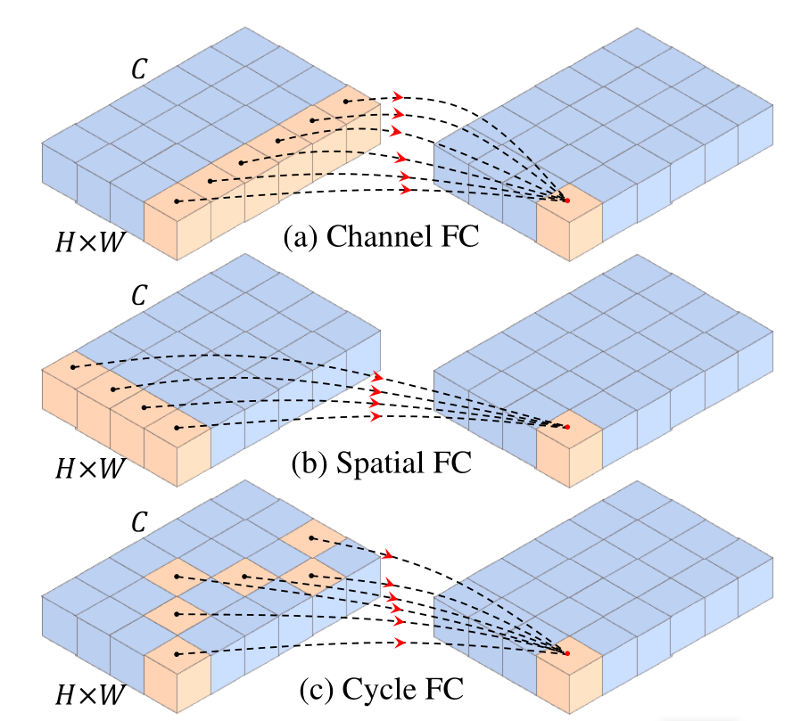
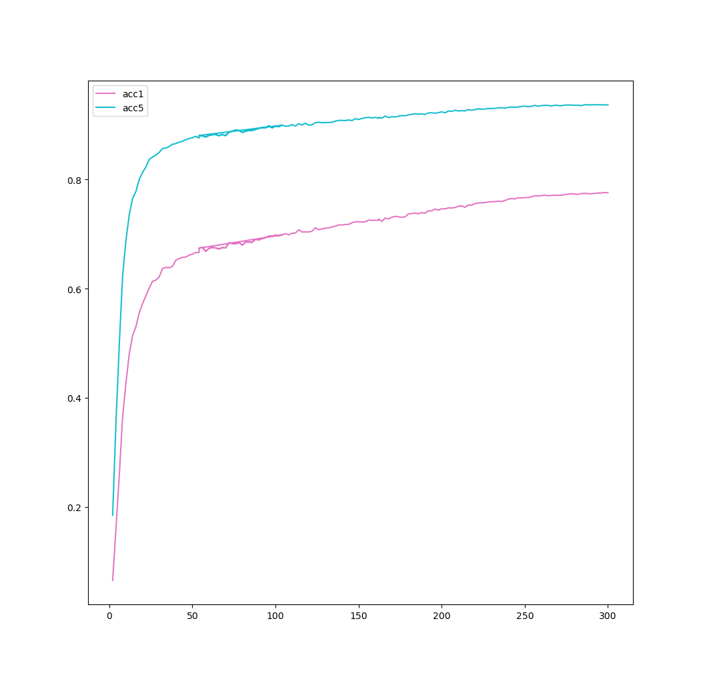

# 基于paddlepaddle实现CycleMLP：A MLP-like Architecture for Dense Prediction, [arXiv](https://arxiv.org/abs/2107.10224)

- 官方源码：[基于pytorch](https://github.com/ShoufaChen/CycleMLP)

- 本代码基于paddleViT实现， 在原有代码的基础上与官方源码对比，实现了进一步的精度对其，并通过官方推荐的数据集完成完整的训练和测试

## 1.简介

现代大多数MLP架构由于其架构与图像的大小有关，需要限定patch的HW大小，无法做到可变处理，作者提出了一种新的全连接层变种，命名为：Cycle FC,并基于此提出了CycleMLP架构，与现代的MLP相比，CycleMLP可以处理不同尺寸的图片，并利用局部窗口实现图像大小的线性计算复杂度，使CycleMLP可以成为通用的MLP架构，其中CycleMLP和CycleFC结构如下图所示：

<p align="center">

<h4 align="center">CycleMLP结构图</h4>
</p>
<p align="center">

<h4 align="center">CycleFC结构</h4>
</p>


## 2. 数据集及复现精度

- 数据集：

本项目使用官方所推荐的经过压缩后的Light_ILSVRC2012数据集， 并在该数据集上完成验证测试部分。

Light_ILSVRC2012数据结构如下图所示：

```
│imagenet/
├──train/
│  ├── n01440764
│  │   ├── n01440764_10026.JPEG
│  │   ├── n01440764_10027.JPEG
│  │   ├── ......
│  ├── ......
├──val/
│  ├── n01440764
│  │   ├── ILSVRC2012_val_00000293.JPEG
│  │   ├── ILSVRC2012_val_00002138.JPEG
│  │   ├── ......
│  ├── ......
```
- 复现精度：

| 模型(Model) | 目标精度(Acc@1) | 实现精度(Acc@1) | Image Size | BatchSize |
| ----------- | --------------- | --------------- | ---------- | --------- |
| CycleMLP-B1 | 78.9            | 77.69           | 224        | 256*4GPUs |

注：由于比赛时间问题，目前模型正在进一步微调中(所以本此先提交)

相关日志文件集模型存放与output文件夹内，目前最优模型在best_cyclemlp300-350文件夹内

#### 日志文件说明：

本项目在Aistudio脚本任务四卡多GPU内训练，(由于OSError: [Errno 5] Input/output error错误，训练中途多次中断,错误原因未知)，为方便检阅，已经手动将其改名为各个epoch段内的训练，并手动将验证结果单独提取出放在`Epoch_val_info.txt`，和`all_val_info.txt`中(下面会单独说明),并编写脚本可绘制图像

- `best_cyclemlp1-52`： epoch：1-52，此版本代码为每10epoch保存一次模型每2个epoch进行一次验证，若本次验证精度acc@1高于上次则保存为Best_CycleMLP。
- `best_cyclemlp_53-104`
- `best_cyclemlp105-160`
-  `best_cyclemlp161-210`：从此版代码开始未改变其他参数，将模型保存改为每50epoch保存一次模型，还是依旧会保存最优的模型
-  `best_cyclemlp211-260`
- `best_cyclemlp261-300`
- `best_cyclemlp301-350`： 300epoch跑完，验证集精度达到77.62%，开始进行微调，加载之前的最优模型，学习率从5e-6开始下降到5e-8结束
- 
- `Epoch_val_info.txt`: 提取前300epoch每个epoch结束时的验证精度acc@1.
- `all_val_info.txt`：提取前300epoch, 所有验证过程的精度变化。
- ``fine_tune_epoch.txt`:提取微调时，每个epoch结束时的验证精度acc@1.
- `fine_tune.txt`：提取微调时，所有验证过程的精度变化

#### 验证集精度变化曲线：

执行script文件夹下`draw.sh`即可




##  3. 准备环境

- Python>=3.6
- yaml>=0.2.5
- [PaddlePaddle](https://www.paddlepaddle.org.cn/documentation/docs/en/install/index_en.html)>=2.1.0
- [yacs](https://github.com/rbgirshick/yacs)==0.1.8
- matplotlib==3.3.4

本项目运行环境：

- 硬件：Tesla V100 * 4（由衷感谢百度飞桨平台提供高性能算力支持）

- [PaddlePaddle](https://www.paddlepaddle.org.cn/documentation/docs/en/install/index_en.html)==2.2.1
- Python==3.7
- [yacs](https://github.com/rbgirshick/yacs)==0.1.8

## 4. 代码结构：

```shell
.
├── acc1_acc5.py----------------------------------# 绘制验证精度
├── auto_augment.py-------------------------------# 数据增强
├── compare_the_param.py--------------------------# 查看与对比模型参数
├── config.py-------------------------------------# 训练参数设置
├── configs
│   └── cyclemlp_b1.yaml--------------------------# 模型参数
├── cyclemlp2.png
├── cyclemlp.png
├── cyclemlp.py-----------------------------------# CycleMLP模型定义
├── dataset
│   └── imagenet----------------------------------# 存放样例训练和验证图片
├── datasets.py-----------------------------------# datatransformer和dataset,dataloader
├── drawing.py------------------------------------# 绘制图像
├── droppath.py-----------------------------------# droppath
├── label_list.py---------------------------------# imagenet1k数据集标签名称
├── losses.py-------------------------------------# loss函数
├── main_multi_gpu.py-----------------------------# 多卡训练 
├── main_single_gpu.py----------------------------# 单卡训练
├── mixup.py--------------------------------------# Mixup
├── output----------------------------------------# 日志及模型文件保存文件夹
├── predict.py------------------------------------# 预测脚本
├── random_erasing.py-----------------------------# 数据增广随机擦除
├── README.md
├── script
│   ├── draw.sh-----------------------------------# 绘制验证集精度图像脚本
│   ├── predict.sh--------------------------------# 预测脚本
│   ├── run_eval_multi.sh-------------------------# 多卡验证脚本
│   ├── run_eval.sh-------------------------------# 单卡验证脚本
│   ├── run_train_multi.sh------------------------# 多卡训练脚本 
│   ├── run_train.sh------------------------------# 单卡训练脚本
│   └── test_model_params.sh----------------------# 查看与测试模型参数脚本
├── transforms.py---------------------------------# RandomHorizontalFlip定义
└── utils.py--------------------------------------# 学习率下降策略
```


## 5. 快速开始

本项目已经部署到了Aistudio脚本任务当中，您可以直接fork下来后运行即可

链接：[CycleMLP](https://aistudio.baidu.com/studio/project/partial/verify/3407443/09bf75ae9cd5495fa4425e4b0c1db5dc)

###  1. 克隆本项目

```shell
git clone https://github.com/shier1/CycleMLP-paddle.git
cd CycleMLP-paddle
```

### 2. 修改参数

请根据实际情况，修改script文件夹下的脚本内容，如：predict.sh.

### 3. 验证模型

多卡请运行：

```shell
sh script/run_eval_multi.sh
```

单卡请运行：

```shell
sh script/run_eval.sh
```

### 4. 训练模型

多卡请运行：

```shell
sh script/run_train_multi.sh
```

单卡请运行：

```shell
sh script/run_train.sh
```

### 5. 模型预测

请运行：

```shell
sh script/predict.sh
```

<p align="center">

<h4 align="center">class_id:sea snak</h4>
</p>

输出结果：

```python
class_id:sea snake, prob:0.6779407262802124, cost time:0.0421
```


## 6. 参考和引用

## Reference

```
@article{chen2021cyclemlp,
  title={CycleMLP: A MLP-like Architecture for Dense Prediction},
  author={Chen, Shoufa and Xie, Enze and Ge, Chongjian and Liang, Ding and Luo, Ping},
  journal={arXiv preprint arXiv:2107.10224},
  year={2021}
}
```

- [paddlepaddle](https://github.com/PaddlePaddle/Paddle)
- [paddleViT](https://github.com/BR-IDL/PaddleViT)

- [paddlepaddle官网](https://www.paddlepaddle.org.cn/)

- [CycleMLP论文](https://arxiv.org/abs/2107.10224)
- [CycleMLP pytorch](https://github.com/ShoufaChen/CycleMLP)

最后：

最后，非常感谢百度举办的[飞桨论文复现挑战赛（第五期）](https://aistudio.baidu.com/aistudio/competition/detail/126/0/introduction)让本人对Paddle有了更加深刻和全面的理解。 同时也非常感谢[朱欤老师](https://github.com/xperzy)团队用[Paddle](https://github.com/paddlepaddle/paddle)实现的[PaddleViT](https://github.com/BR-IDL/PaddleViT.git)，本项目中大部分代码都是从其中而来, 而仅仅通过对比原pytorch代码，进一步实现了与原版代码训练过程的对其， 但同样收益匪浅！


## Contact

- Author: Shier
- Email: [zyanping14@gmail.com](xyanping14@gmail.com)
